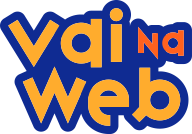

Uma plataforma de formação de talentos digitais

Desde 2017, nossa Escola de Tecnologia forma talentos de todo Brasil, oriundos das classes C, D e E, em programação digital avançada e habilidades socioemocionais.

Com o objetivo de diminuir de forma inteligente a desigualdade social, qualificamos pessoas, geramos empregos dignos e reduzimos a lacuna de gênero no país.

## Tecnologias Usadas

## Aulas de Soft Skills

Além das habilidades técnicas, também oferecemos aulas de soft skills para desenvolver competências como comunicação, trabalho em equipe, resolução de problemas e muito mais.

