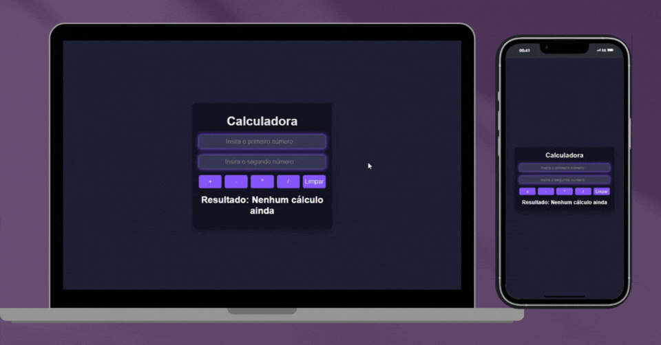

# Calculadora - Desafio Vai na Web

Bem-vindo(a) ao projeto Calculadora, desenvolvido como parte do desafio do Vai na Web. Este projeto foi construído com React, Vite e SCSS, proporcionando uma interface moderna e responsiva para realizar cálculos básicos.

## Índice

- [Descrição](#Descrição)
- [Funcionalidades](#Funcionalidades)
- [Tecnologias Utilizadas](#Tecnologias-utilizadas)
- [Instalação](#Instalação)
- [Como Usar](#Como-usar)
- [Contato](#Contato)

## Descrição

Esta calculadora foi criada como parte de um desafio do Vai na Web, com o objetivo de desenvolver uma aplicação prática usando React e Vite. A calculadora permite realizar as quatro operações básicas (adição, subtração, multiplicação e divisão) e inclui um botão extra para limpar a tela e reiniciar os cálculos. O projeto também foca em responsividade, garantindo uma ótima experiência em dispositivos desktop, mobile, tablets e até smartwatches.

## Funcionalidades

- Adição, subtração, multiplicação e divisão
- Botão para limpar a tela e reiniciar os cálculos
- Interface moderna e responsiva
- Efeito de borda brilhante nos inputs ao receber foco


## Tecnologias Utilizadas

 **SCSS**: Preprocessador CSS que adiciona funcionalidades como variáveis, aninhamento e mixins

 **JavaScript**: Linguagem de programação para adicionar interatividade

 **React**: Biblioteca JavaScript para construção de interfaces de usuário

 **Vite**: Ferramenta de build rápida e moderna para projetos web

## GIF da Página



## Link para o Deploy

Acesse a aplicação em produção: [](https://desafio-calculadora-eta.vercel.app/)


## Instalação

1. Clone o repositório:
   ```bash
   git clone https://github.com/seu-usuario/calculadora-vai-na-web.git
2. Navegue até o diretório do projeto:
   ```bash
   cd desafio-calculadora
3. Instale as dependências:
   ```bash
   npm install
4. Instale o Sass:
   ```bash
   npm install -D sass
5. Inicie o servidor de desenvolvimento:
   ```bash
   npm run dev
## Como Usar

1. Abra o navegador e acesse [http://localhost:3000](http://localhost:3000).
2. Utilize os campos de input para inserir os números desejados.
3. Clique nos botões de operação (+, -, *, /) para realizar o cálculo.
4. O resultado será exibido abaixo dos botões.
5. Para limpar a tela e iniciar um novo cálculo, clique no botão "Limpar".

